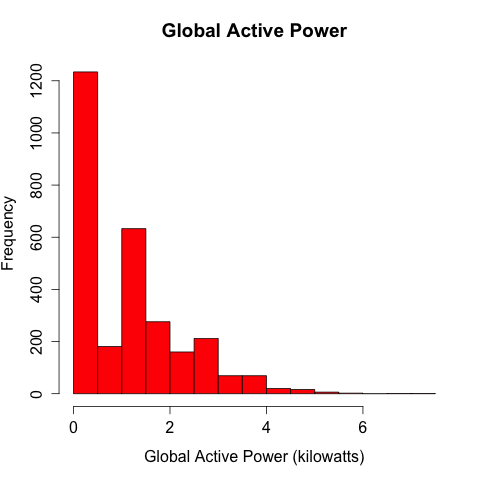

# Course Project 1

The code contained in this repository was written for the final project for Coursera's Exploratory Data Analysis Course.

The original assignment instructions including some test code written for completing each step can be found in `project1.html`.

## Loading the data

The functions in `utilities.R` have been written to prepare the data for plotting. It is NOT necessary to manually run these functions before creating any of the plots and is included here for reference only.

* `ret.data()` - prepares the raw data set.
* `get.data()` - get the data as a cleaned dataframe.
* `get.days()` - get the data for the two relevant days.

## Making Plots

The code to create each of the individual plots can be found in these files. It should be possible to source each of these files to re-create the intended plot.

* plot1.R
* plot2.R
* plot3.R
* plot4.R

The following is a comparison of the original plot (first plot) and the plot as generated by the code in this project (second plot).

The generated plots can be found in the `output` directory.

### Plot 1

 

### Plot 2

### Plot 3

 

### Plot 4

 

